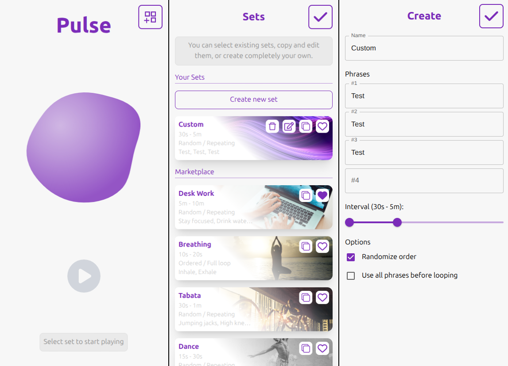

# Pulse App
Random Frequent Voice Commands

Choose phrases set, interval and repetitiveness, and give control to your own personal Pulse Agent.

### Marketplace:
* *Desk Work* - helping you remember about correct posture, breaks and drinking
* *Breathing* - exercise for breath control
* *Tabata* - random exercises to workout
* *Dance* - random instructions for improv
* ...
*You can create your own or edit those predefined.*
